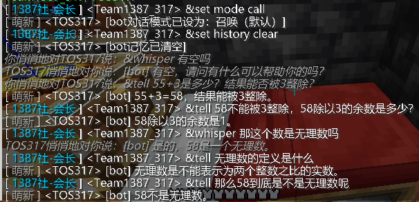

# ChatBot in 落英乡坊（原H.O.P.E.）mc服务器

## 版本号：V0.1 pre-release 2

## 作者：YXY317Coder

---

## 效果

 - 可以在服务器聊天栏中发送含 `&tell` 或 `&whisper` 的文本来与bot进行聊天
 - `&set` 功能
 ```
 &set history clear //清空ai记忆
 &set history 1 //设置ai记忆只有一步
 &set mode call //设置为使用关键词聊天模式
 &set mode monitor //设置为监视聊天模式（有一点bug）
 ```
 - 记录服务器log日志和talk日志
 - 离线账号
 - 可自定义提示词（prompt）
 - 自定义玩家名称
 

## 部署

 1. 下载 Node.js
 2. 在命令行（Win+R输入cmd）中输入
 ```bash
 npm install mineflayer
 npm install ws axios sharp
 ```
 （可能还需要npm其它库，但我忘记了）
 3. 更改`login.js`第32行（用户名），第38行的内容（密码），第5/6/7行的ai密钥等，以及所有的 `TOS317`（第8行的提示词可改可不改）
 4. 如需使用，可使用Node.js运行`login.js`。等控制台显示登录成功就可以在服务器聊天栏中发送含 `&tell` 的文本来与bot进行聊天啦

## 注意

 1. 不要频繁使用ai
 2. 由于是预发布版，可能bug较多，有bug可反馈（如无反馈通道可以向`YXY317Coder@qq.com`反馈）
 3. 原谅317写的代码有点石
 4. 部分使用ai生成（bush

 ---

 # English
 ## Version: V0.1 pre-release 2
## Author: YXY317Coder
---
## Effect
 - You can send text containing `&tell` or `&whisper` in the server chat bar to chat with the bot
 - `&set` function
 ```
 &set history clear // Clear AI memory
 &set history 1 // Set AI memory to only one step
 &set mode call //Set to use keyword chat mode
 &set mode monitor // Set to monitor chat mode (with a minor bug)
 ```
 - Record server log and talk log
 - Offline account
 - Customizable prompt
 - Custom player name
 
## Deployment
 1. Download Node.js
 2. Enter in the command line (Win+R, enter cmd)
 ```bash
 npm install mineflayer
 npm install ws axios sharp url
 ```
 (There may be other npm libraries needed, but I forgot)
 3. Modify the content on line 32 (username), line 38 (password), line 5,6,7(spark lite ai passkeys) , and all instances of `TOS317` (the prompt word on line 8 can be modified or left unchanged) in `login.js`
 4. To use it, run `login.js` using Node.js. Once the console displays successful login, you can send a text containing `&tell` in the server chat to chat with the bot
## Note
 1. Don't use AI frequently
 2. As it is a pre-release version, there may be many bugs. If you encounter any, please provide feedback (if there is no feedback channel, you can send your feedback to `YXY317Coder@qq.com`)
 3. Forgive me for the somewhat unrefined code written by 317
 4. Partially generated using AI (bush)